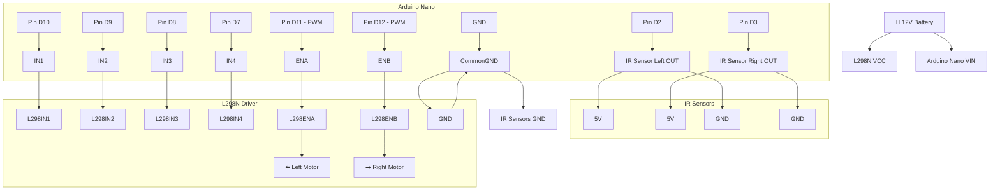
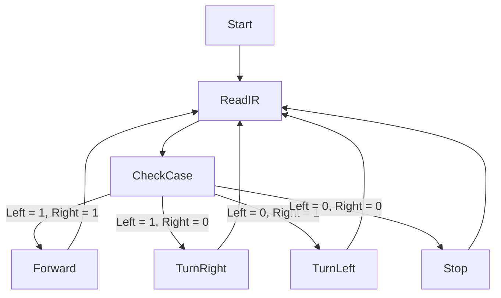

# 🤖 Line Follower Robot Using Arduino Nano, L298N & IR Sensors

This project demonstrates a fully functional **line follower robot** controlled by an **Arduino Nano**, using **IR sensors for line detection** and an **L298N motor driver** to control two DC motors. The robot follows a black line on a white surface using simple logic and PWM-based motor control.

It’s a great beginner-friendly project to understand:
- 🔍 Sensor-based control
- ⚙️ Motor driving using an H-Bridge (L298N)
- 💡 Real-time decision-making logic

---

## 📷 Project Photos & Simulation

> Replace the placeholders below with actual images from your circuit and simulation.

)

---

## 🧠 How It Works

The robot uses **two IR sensors** to detect whether it is over the black line or the white background. The sensor outputs are read by the Arduino Nano, which then determines:

- If both sensors detect white → go **forward**
- If left detects black, right detects white → turn **right**
- If right detects black, left detects white → turn **left**
- If both detect black (off-line) → **stop**

The Arduino uses **PWM signals** to control motor speed via the **ENA/ENB** pins of the **L298N** motor driver.

---

## 🧱 Components Used

| Component         | Quantity | Description                       |
|------------------|----------|-----------------------------------|
| Arduino Nano     | 1        | Main microcontroller              |
| L298N Motor Driver | 1        | Drives 2 DC motors                |
| IR Sensors       | 2        | Line detection (left and right)   |
| DC Motors        | 2        | Drive left and right wheels       |
| 12V Battery      | 1        | Power for motors and driver       |
| Wires & Chassis  | As needed | For building the robot            |
| Proteus 8+       | -        | Simulation environment            |

---

## 📡 Wiring Diagram (Mermaid)

## 🧠 Functional Flowchart (Mermaid)

